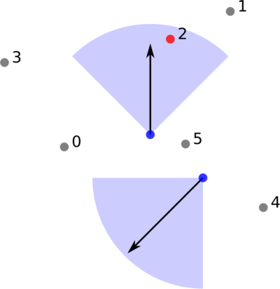

[](https://github.com/bast/flanders/actions)
[](LICENSE)


# Flanders: Fast 2D nearest neighbor search with an angle

```
                                                        `.-:://////:-.`
                                                 `-/oyhddddmmddddddNmdmdhs/`
                                              -ohddddddddddddNddddddNddddmmds.
                                            `hmmmmmdddddddddddNddddmmddddmmddm.
                                           `hddddddmmddddddhyyysoossyhdmNmdddNs
                                           sddddddddmmho/:-------------:odmmmmo
                                          :mddddddddd+-------------------:hddd.
                                          dddddddddm+---------------------:ms.
                                         :mddddddddd-----------------------s/`
                                         yddddddddds------------------------:s
                                        `mddddddddm+-----://////+/:---://////y`
                                        -Nddddddddm/----+:`     `./+-+-`    `.+:
                                        /mddddddddN:---o`          -d-    -.   o-
                                        omddddddddN////y  -d/      `m.    y+   +:
                                        sdddhhNmmmN+/::o: `-`     `+so++//:. `:+`
               `---.                    ydd+::mdddm:----/+-.````-:+:------:+s/-
               o/::/+-                  sN:-oomdddm+------://+///:---------:s
       `.-.`   s-----+/`                oN:---smddds------------:+oyhhysssydhs:.
      -o/://+-`.o:----/o`               /mh:---hyyy/----------+hdmmmmdddddmmmddho.
      /+-----:+/-o:----:+`       `..    .mddyyydo-----:///::ohdmmdmmdmddNdmmdmmddd/
       :+/-----:+/y-----:+-`  .:+///+.   dddddddd----:mMMNNddddddmddmdddmmdmddmdddm:
       ``-/+:----::-------:/+++:----/+   +mdddddN----:MMMMMNmmmmmmmdddddddhhhhhys+/.
    .////+//+o:--------------/-----/o`    sdddddm/----oNmdmNNNNMMMm//os--...``
    y:-----:/+o------------------:o:       :ydddm+-----:oyyyysydMMm:::o+.
    :o/:----------------+o:-----:s`          .::+o--------://++oooo+:--:s
      -:/+/:--------------s/----s.              -o------------------:/o+.
          `-/+o------------/---+d-             `+o------------------::h
              .s/---------:::ohhhs             y.-++:-----------------d:`
               dhys+///+oyhhhhyhm/            `s````:/++o+//:::://+++/-.s.
              /dddhhhhhhyyhhhddhym`           -s`````````..-:::/h/s-````.s`
             :dyyhddddddddddhyyyym           `ydy-`````````````s:.-o/````sy/-`
             yyyyyyyyyyyyyyyyyyyhs     `./+ooymhyhy/.`````````:o....++``:dmdhhhso:`
             dyyyyyyyyyyyyyyyyyym:`-/oyddhyyyyhddyyhhs+-``````hso++ohd++dyyddyyyyhhyo/`
             myyyyyyyyyyyyyyyyyyNhhhyyyyyyyyyyyyddyyyyyhdyso++ddhmhmddhhyyyyddyyyyyyyhdy+.
```


## Installation

```
$ pip install flanders
```


## Example

In this example we have 6 points (numbered 0 to 5) and two observer
points with a certain view vector and view angle (90 degrees). The first observer
point finds point 2. The second observer point does not find any
neighbor within the view angle and returns -1.

[

Example code:
```python
import flanders


# as a first step we build the search tree
# we can later reuse the search tree many times

points = [
    (60.4, 51.3),
    (173.9, 143.8),
    (132.9, 124.9),
    (19.5, 108.9),
    (196.5, 9.9),
    (143.3, 53.3),
]

tree = flanders.build_search_tree(points)


# now we will search the indices of nearest neighbor points
# for two observer points

observer_coordinates = [(119.2, 59.7), (155.2, 30.2)]
view_vectors = [(0.0, 1.0), (-1.0, -1.0)]
view_angles_deg = [90.0, 90.0]

indices = flanders.nearest_indices_from_coordinates(
    tree, observer_coordinates, view_vectors, view_angles_deg
)

assert indices == [2, -1]


# instead of using observer coordinates, also the original
# points themselves can be observers and we can select them
# by their index

observer_indices = [0, 1, 2, 3, 4, 5]
view_vectors = [(1.0, 1.0) for _ in observer_indices]
view_angles_deg = [90.0 for _ in observer_indices]

indices = flanders.nearest_indices_from_indices(
    tree, observer_indices, view_vectors, view_angles_deg
)

assert indices == [5, -1, 1, 2, -1, 1]
```


## Efficiency considerations

The above example is very small and simple but this library starts to shine
once you have very many points and/or very many observers where a noddy
implementation would take too long to compute.

Example timing for 1 M points and 10 k observers (on i7-10710U):
- constructing the search tree: 3.0 s
- nearest neighbor search: 9.6 s

If you compute nearest neighbors for many observers it is a good idea to send
in an entire batch of observers instead of computing one by one.  If you send
in an entire batch, the code will shared-memory parallelize the loop over the
observers.


## References used during development

- https://en.wikipedia.org/wiki/Nearest_neighbor_search
- https://en.wikipedia.org/wiki/K-d_tree
- http://www.slideshare.net/awebneck/the-post-office-problem
- http://www.cs.nyu.edu/~roweis/papers/Ahmed_msc_thesis.pdf
- http://dl.acm.org/citation.cfm?doid=361002.361007
